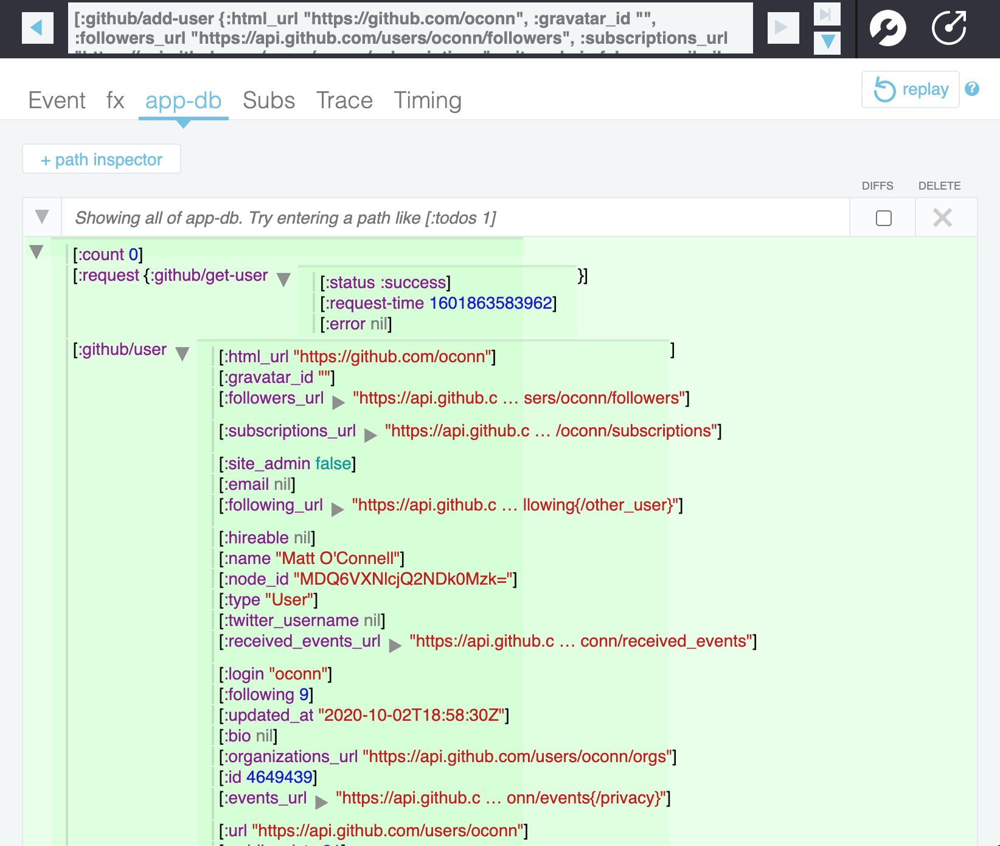
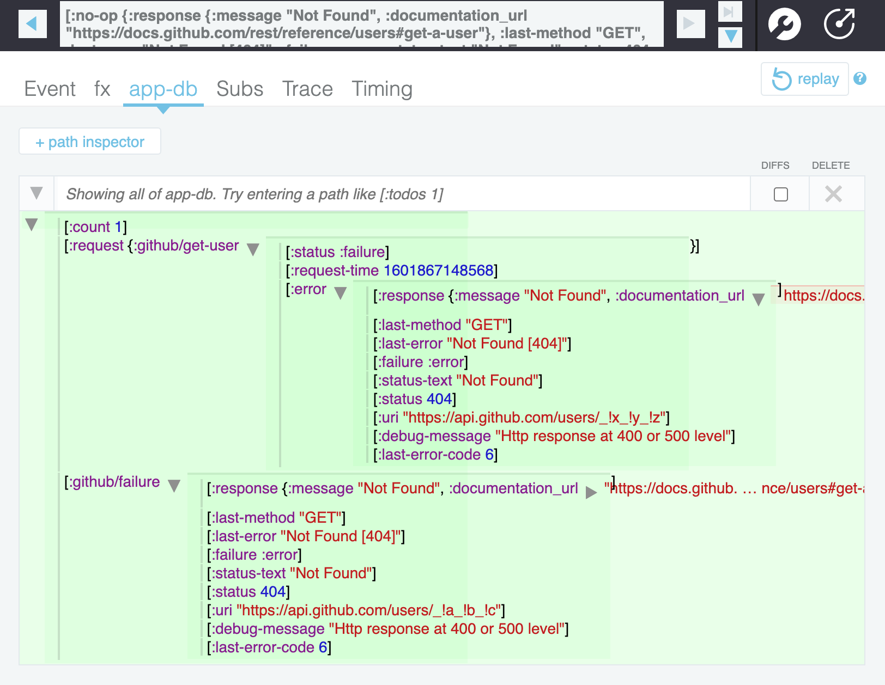

# re-frame-request

A ClojureScript library that tracks request state in [re-frame](https://github.com/Day8/re-frame) applications.

## Install

[](https://clojars.org/oconn/re-frame-request)

## Usage

### Register Events and Subscriptions

Events and subscriptions can be registered seperatly;

```cljs
(ns app.events
  (:require [re-frame-request.core :as rfr]))

; if providing no `opts`, :
(rfr/register-events {}) 
```

```cljs
(ns app.subscriptions
  (:require [re-frame-request.core :as rfr]))

(rfr/register-subscriptions)
```

Or you can use the `register-all` function to register both subscriptions & events.

```cljs
(ns app.core
  (:require [re-frame-request.core :as rfr]))

; if providing no `opts`:
(rfr/register-all {})
```

### Request data

Once an event is dispatched that calls the `re-frame-request` handler, information about that request will automatically be tracked in application state. Here is an example of an event that uses `re-frame-request`.

```cljs
(rf/reg-event-db
  :github/add-user
  (fn [db [_ user]]
    (assoc db :github/user user)))

(rf/reg-event-db
  :github/handle-failure
  (fn [db [_ error]]
    (assoc db :github/failure error)))

(re-frame/reg-event-fx
 :github/get-user
 (fn [{:keys [db]} [_ user-name]]
   {:db db
    :request {:name :github/get-user
              :method :get
              :uri (str "https://api.github.com/users/" user-name)
              :response-format :json
              :on-success [:github/add-user]
              :on-failure [:github/handle-failure]}}))
```

Note: This uses the `ajax-cljs` under the hood so reference the [docs](https://github.com/JulianBirch/cljs-ajax) for usage.

#### `name`

The `name` property is the only added property used and is required to track a request. It must be a unique keyword for each different request.

### Tracking the request in state: success

Suppose dispatch the following event:
```cljs
(re-frame.core/dispatch [:github/get-user "oconn"])
```

Under the `:request` key, the `:name`  parameter key’s value will be the status of our request. As seen from re-frame-10x UI:



### Tracking the request in state: failure

Suppose we dispatch the event, but request a non-existent Github user:
```cljs
(re-frame.core/dispatch [:github/get-user "_!x_!z_!y"])
```

We'll see that the request fails ("404"), and that the `:request` key in the state contains the error under `:error`:



In fact, we probably didn't even need to save that error separately in the state under `:github/failure` :-)  

### Register Spec Checks (Optional)

On applcation state change, `re-frame` [interceptors](https://github.com/Day8/re-frame/blob/master/docs/Interceptors.md) can be used to ensure an application's state is not modified in an unexpected way. By hooking into an interceptor's [after](https://github.com/Day8/re-frame/blob/master/docs/Interceptors.md#executing-a-chain) function, a user could apply `re-frame-request`s [spec](https://clojure.org/guides/spec) to help maintain application state integrity.

#### 1. Add Spec Interceptor

This idea was inspired by the great folks who wrote `re-frame`. [Link](https://github.com/Day8/re-frame/blob/master/examples/todomvc/src/todomvc/events.cljs#L9)

```cljs
(ns app.interceptors.spec
  (:require [cljs.spec.alpha :as s]
            [re-frame.core :as re-frame]))

(def ^:private attribution
  "https://github.com/Day8/re-frame/blob/master/examples/todomvc/src/todomvc")

(defn check-and-throw
  ^{:doc "Throws an exception if `db` doesn't match the Spec `a-spec`."
    :attribution attribution}
  [a-spec db]
  (when-let [error (s/explain-data a-spec db)]
    (js/console.error (clj->js error))))

(def
  ^{:doc "Ensures the db remains in a valid state"
    :attribution attribution}
  check-spec-interceptor (re-frame/after
                          (partial check-and-throw :app.db.core/db)))
```

#### 2. Use Spec Interceptor

Add the spec checking interceptor any event you want to enforce checks on.

```cljs
(ns app.events.event-ns
  (:require [app.interceptors.spec :refer [check-spec-interceptor]])

(re-frame/reg-event-db
  :app-event/some-event
  [[check-spec-interceptor]]
  (fn [db _]
    (modify-db db))
```

Note: Because the way this is setup, you'll be running spec against your entire application state on each change, which could be costly. You may want this feature to be toggled depending on the environment you're running in (Development / QA / Production).

## License

Copyright © 2017 Matt O'Connell

Distributed under the Eclipse Public License.
